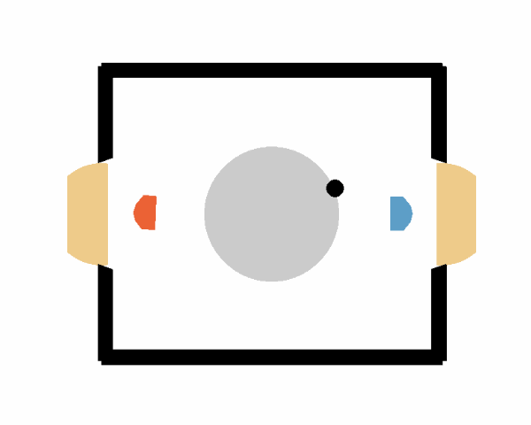
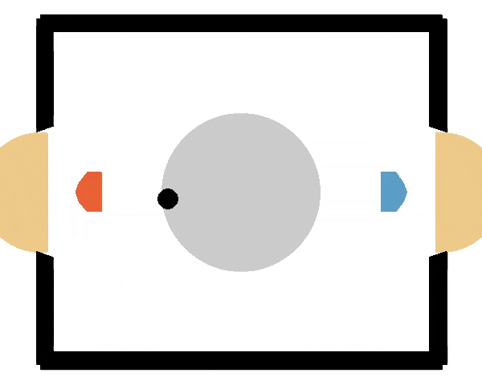

# RL Project  

## TD3 by Béla Umlauf  

[**Download Model Weights**](https://drive.google.com/drive/folders/126NozgxKaZQaP_XyEHWZUMdtWS82TShI?usp=sharing) 
### Gameplay Demonstration  
- **TD3 vs Weak Opponent**  
   
- **TD3 vs Strong Opponent**  
  


## TD-MPC2 by Jonas Klötzl

[**Download Model Weights**](https://drive.google.com/drive/folders/1MkM6Q-X8fcvgn3UfaFKNzriIkRT1n-3p?usp=sharing)

This codebase was used to train an TD-MPC2 agent for the Hockey Environment. Most important contribution is the `tdmpc2/tdmpc2/envs/hockey.py` file containing the hockey environment and the wrapper. Smaller changes in `tdmpc2/tdmpc2/envs/__init__.py`, `tdmpc2/tdmpc2/train.py` and `tdmpc2/tdmpc2/config.yaml`.

- **Example Evaluation**  
  

Run training with:
```
$ python train.py task=hockey-NORMAL steps=150000
```
## SAC by Regine Lendway
[** Download Model Weights**] (https://drive.google.com/file/d/1RnPOH-9JXV2RaFibux4Pr5wUxUJjaLiu/view?usp=drive_link)
